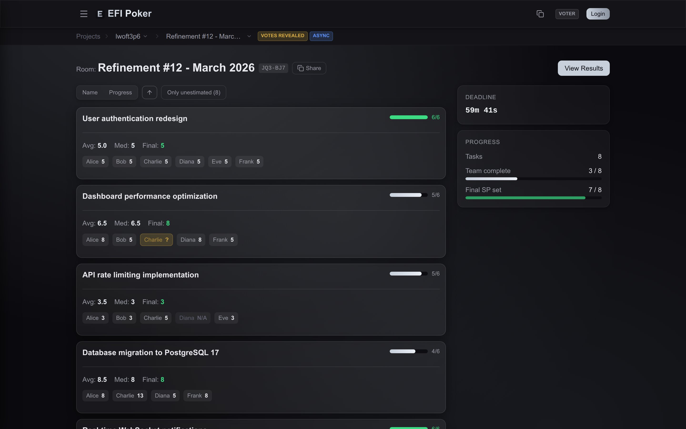
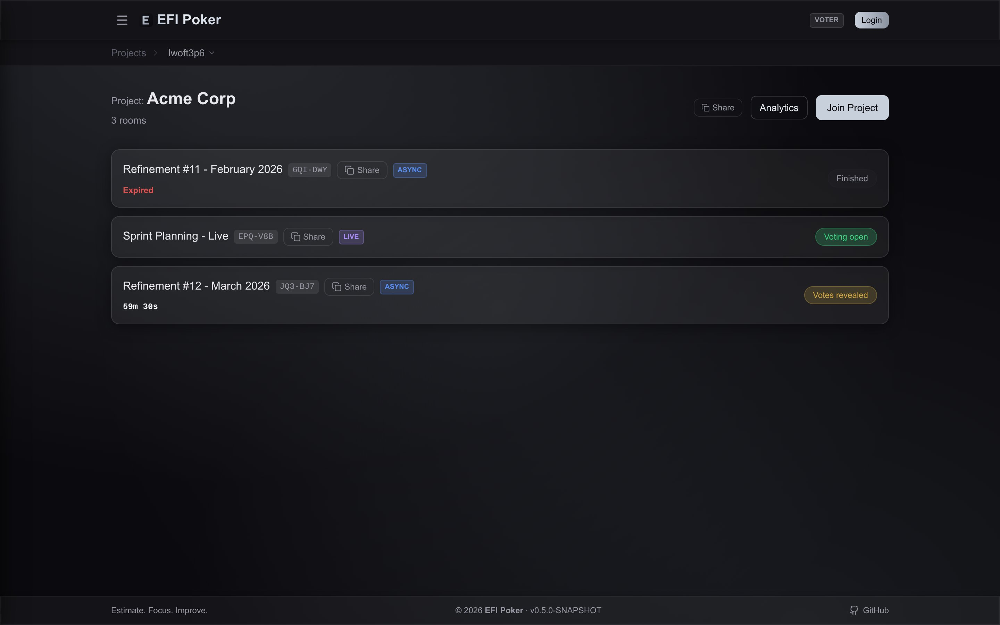
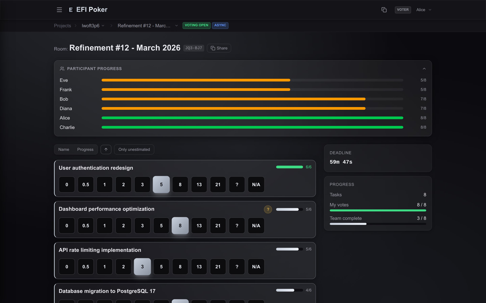
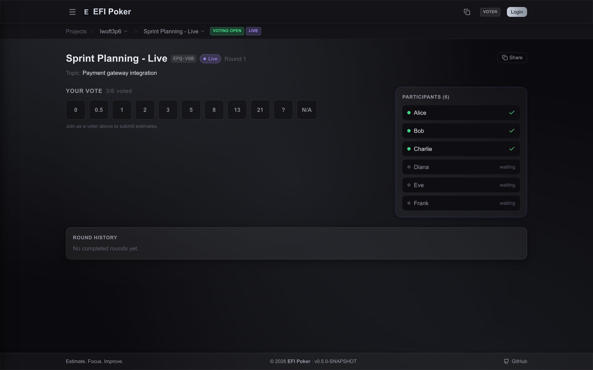
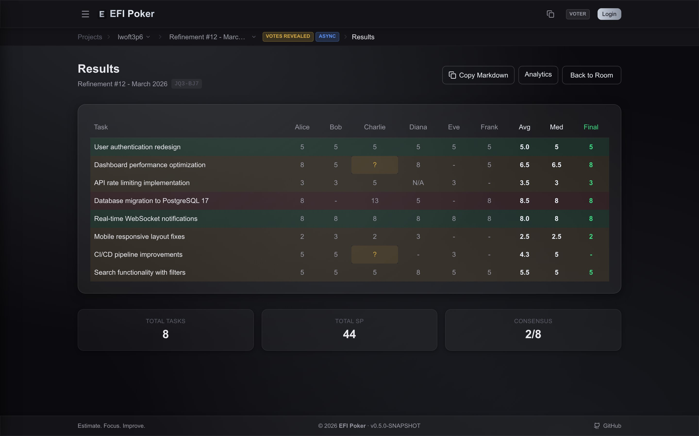
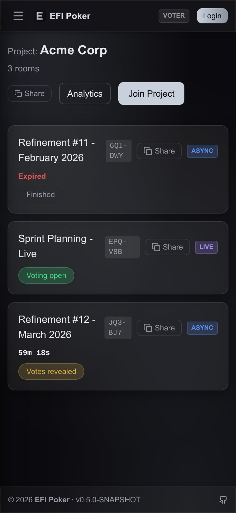
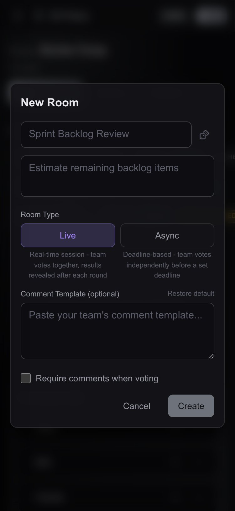
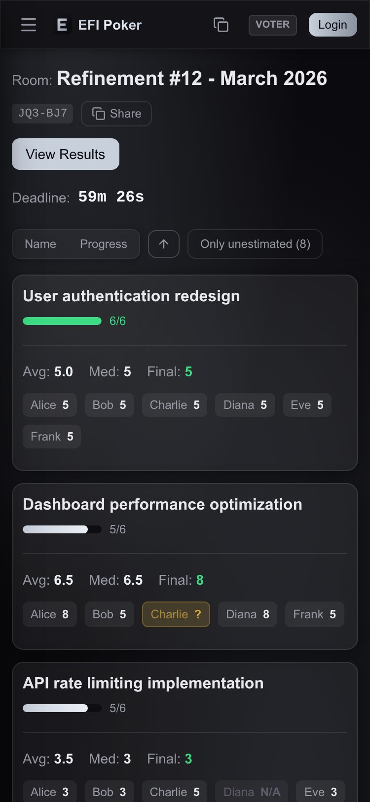
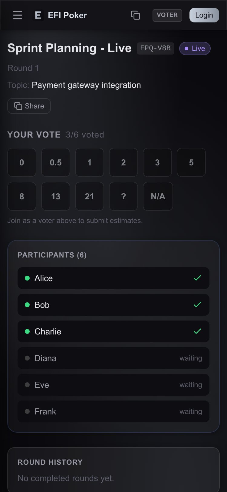

# EFI Poker

[](https://github.com/slawomir-andreasik/efi-poker/releases)
[](https://opensource.org/licenses/MIT)
[](https://github.com/slawomir-andreasik/efi-poker/actions)
[](https://openjdk.java.net/)

> Estimate. Focus. Improve.

Sprint Planning Poker for Scrum teams. Replace manual estimation on video calls with a dedicated tool - create projects, share links and estimate in rooms with hidden votes and classic poker reveal.

**Live demo:** [app.efipoker.com](https://app.efipoker.com)

| |
|:---:|
|  |
| *Async estimation room with revealed votes* |

## Features

- **Two estimation modes** - async (deadline-driven) and live (real-time poker table)
- **Hidden votes** with classic poker reveal
- **Finish session** - end refinement early with auto-assigned final estimates from median
- **N/A and ? votes** - mark tasks as not applicable or flag uncertainty
- **Markdown and CSV export** of estimation results
- **Project/room/task hierarchy** - organize work by project, create rooms per sprint
- **Admin tools** - user management, RBAC, project admin codes
- **No registration required** - participants join by nickname, no account needed
- **PWA support** - installable on mobile
- **Flexible auth** - built-in password, LDAP and OAuth2 (Auth0) providers

## Quick Start

```bash
docker compose up -d
```

Open [http://localhost:8080](http://localhost:8080) and log in with `admin` / `changeme`.

To customize settings, copy `.env.example` to `.env` and adjust values before starting.

## Development

### Prerequisites

- Java 25 ([SDKMAN](https://sdkman.io/) recommended)
- [Bun](https://bun.sh/) (frontend runtime + package manager)
- [Docker](https://docs.docker.com/get-docker/) (PostgreSQL + optional full-stack dev)

### Local development

```bash
cp .env.example .env   # configure environment
make dev               # start DB + backend + frontend
```

Or run everything in Docker:

```bash
make docker-dev
```

### IntelliJ IDEA

The project includes shared run configurations in `.run/`:

| Configuration | Description |
|---------------|-------------|
| **Backend** | Spring Boot app with `local` profile |
| **Frontend** | Vite dev server with HMR |

Both configurations load environment variables from `.env` (requires the [EnvFile](https://plugins.jetbrains.com/plugin/7861-envfile) plugin).

To get started:
1. Copy `.env.example` to `.env`
2. If port 5432 is already in use (e.g. system PostgreSQL), set a different port:
   ```
   POSTGRES_PORT=15432
   ```
   Docker Compose will bind to this port, and Spring Boot will auto-detect it.
3. Run **Backend** and **Frontend** from the Run Configurations dropdown

### Key commands

| Command | Description |
|---------|-------------|
| `make dev` | Start dev environment (DB + backend + frontend) |
| `make dev-stop` | Stop dev environment |
| `make docker-dev` | Start dev in Docker containers |
| `make build` | Full build (backend + frontend) |
| `make server-test` | Backend tests only |
| `make client-lint` | ESLint check |
| `make client-test` | Frontend tests |
| `make api-generate` | Regenerate API clients from OpenAPI |
| `make spotless` | Auto-fix Java formatting |
| `make pre-push` | Format + all checks (run before pushing) |
| `make image-build` | Build Docker images locally |
| `make image-push` | Build and push to GHCR |

## Tech Stack

| Layer | Technology |
|-------|------------|
| Backend | Java 25, Spring Boot 4.0, Spring Modulith |
| Database | PostgreSQL 17, Liquibase migrations |
| Frontend | React 19, TypeScript, Vite 7, Tailwind 4 |
| Runtime | Bun (frontend), Gradle 9 (backend) |
| API | OpenAPI-first (spec generates Java interfaces + TypeScript client) |
| Auth | JWT + password, LDAP, OAuth2 (Auth0) |
| Observability | Micrometer + OpenTelemetry, Prometheus metrics |
| Containers | Docker, Paketo Buildpacks (backend) and nginx (frontend) |

## Environment Variables

| Variable | Default | Description |
|----------|---------|-------------|
| `ADMIN_USERNAME` | `admin` | Bootstrap admin username |
| `ADMIN_PASSWORD` | `changeme` | Bootstrap admin password |
| `POSTGRES_HOST` | `localhost` | Database host |
| `POSTGRES_PORT` | `5432` | Database port |
| `POSTGRES_DB` | `efipoker` | Database name |
| `POSTGRES_USER` | `efipoker` | Database user |
| `POSTGRES_PASSWORD` | `changeme` | Database password |
| `JWT_SECRET` | - | JWT signing secret (min 64 chars) |
| `JWT_EXPIRATION` | `86400` | JWT token expiration in seconds |
| `AUTH0_ENABLED` | `false` | Enable Auth0 OAuth2 login |
| `AUTH0_DOMAIN` | - | Auth0 tenant domain |
| `AUTH0_CLIENT_ID` | - | Auth0 client ID |
| `AUTH0_CLIENT_SECRET` | - | Auth0 client secret |
| `LDAP_ENABLED` | `false` | Enable LDAP authentication |
| `LDAP_URL` | - | LDAP server URL (e.g. `ldap://localhost:389`) |
| `LDAP_BASE_DN` | `dc=example,dc=com` | LDAP search base |
| `LDAP_USERS_DN` | `ou=users` | LDAP users organizational unit |
| `LDAP_BIND_DN` | - | LDAP bind DN for search |
| `LDAP_BIND_PASSWORD` | - | LDAP bind password |
| `LDAP_USER_FILTER` | `(uid={0})` | LDAP user search filter |
| `REGISTRATION_ENABLED` | `false` | Allow public user registration |

## Project Structure

```
api/                  OpenAPI specs + code generation
  src/main/resources/openapi/   Source YAML (modular: paths/, schemas/)
  src/main/resources/           Flattened spec (generated, committed)
backend/              Spring Boot application
  src/main/java/                Source code (Spring Modulith modules)
  src/main/resources/           Config + Liquibase migrations
  src/test/                     Unit + integration tests
frontend/             React SPA
  src/                          TypeScript source
  public/                       Static assets
docs/                 Deployment guide and images
.claude/              Claude Code rules and project conventions
docker-compose.yml    Dev database (PostgreSQL)
compose.yaml          Quick start with pre-built images
compose.dev.yaml      Full Docker dev environment
```

## Deployment

See [docs/deployment.md](docs/deployment.md) for Docker Compose and Kubernetes deployment examples.

## Screenshots

| | |
|:---:|:---:|
|  |  |
| *Project dashboard with rooms* | *Async voting with hidden estimates* |
|  |  |
| *Live poker table with real-time updates* | *Results summary and export* |

<table>
<tr>
<td align="center"><br><em>Project</em></td>
<td align="center"><br><em>Create room</em></td>
<td align="center"><br><em>Voting</em></td>
<td align="center"><br><em>Live session</em></td>
</tr>
</table>

## License

[MIT](LICENSE)
